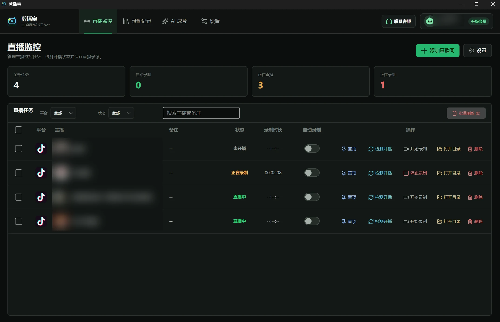
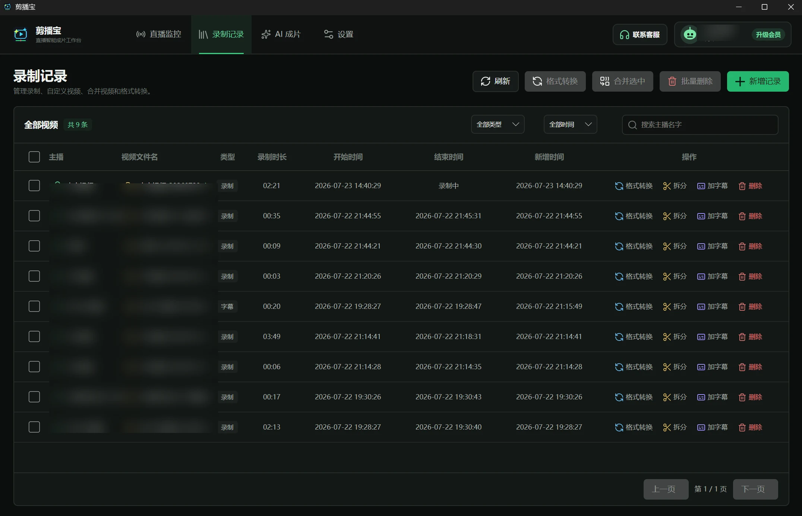
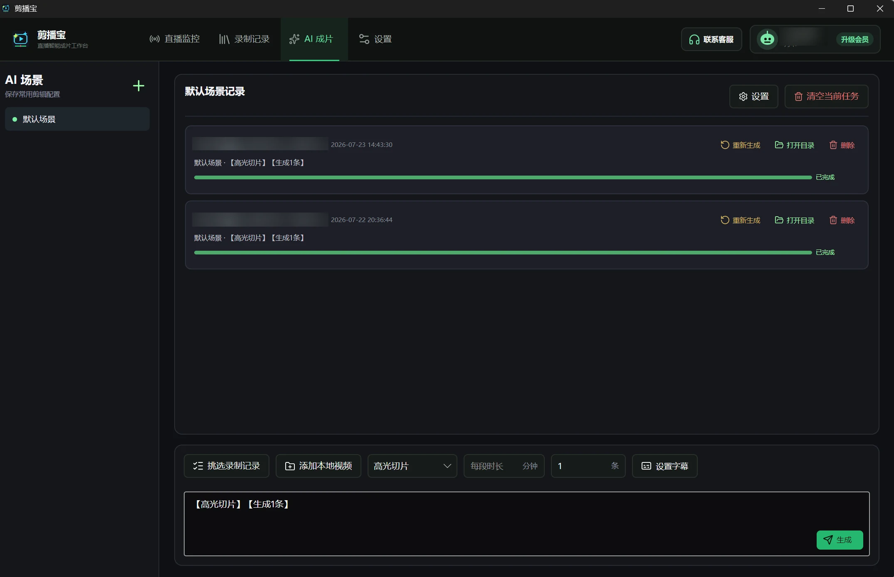

# 剪播宝 StreamCut

**剪播宝 StreamCut** 是一款面向直播运营、短视频创作者和切片团队的直播录制与 AI 自动成片工具。

它帮助用户把抖音、快手等直播内容录制下来，并进一步整理成可发布的短视频素材，例如完整录播分段、高光切片、知识干货切片和字幕视频。

> 适合想把长直播内容快速沉淀为短视频作品的团队和个人。

## 立即下载

[下载 Windows 版](https://rjxa-1255956552.cos.ap-guangzhou.myqcloud.com/%E5%89%AA%E6%92%AD%E5%AE%9D.zip)

## 核心功能

- **直播监控录制**：添加直播间后自动检测开播状态，支持抖音、快手直播录制。
- **自动录制**：主播开播后可自动开始录制，减少人工盯播。
- **录制记录管理**：按主播、时间、类型筛选录制文件，支持本地目录打开、拆分、格式转换、加字幕。
- **AI 成片**：选择录制记录或本地视频，输入剪辑要求后自动生成剪辑任务。
- **完整录播分段**：把长直播按内容完整性分成多段，避免故事、讲解或连麦内容被截断。
- **高光切片**：自动寻找直播中的精彩互动、笑点、冲突点和传播点。
- **知识干货切片**：从课程、访谈、经验分享中提取独立知识片段。
- **字幕设置**：支持字幕开关、字体颜色、字号、位置、背景和透明度设置。
- **会员与额度管理**：支持登录、注册、会员状态、AI 额度和软件更新。

## 产品界面

### 直播监控

集中管理直播间，查看开播状态、录制状态、自动录制和常用操作。

### 录制记录

管理录制视频、筛选记录、格式转换、拆分和加字幕。

### AI 成片

选择录制素材或本地视频，输入剪辑要求后生成任务并查看进度。

## 适用场景

### 直播带货切片

围绕商品讲解、价格机制、用户提问和成交氛围提取片段，适合把一场长直播拆成多条可发布作品。

### 连麦与娱乐高光

识别直播中的互动高潮、反转、笑点和节目效果，快速生成短视频素材。

### 知识干货复用

把课程、访谈、讲座、经验分享拆成独立知识点，方便二次发布。

### 完整录播分段

将长直播按内容完整性拆分，适合做系列录播作品，减少手动找点和切片时间。

## 使用流程

1. 添加直播间，或选择已有录制记录、本地视频。
2. 输入剪辑需求，例如“生成 3 条高光切片，每条 3 分钟以内”。
3. AI 分析直播内容，生成剪辑方案。
4. 软件自动导出成品视频。
5. 用户预览后发布到抖音、快手等短视频平台。

## 支持平台

- Windows
- 抖音直播录制
- 快手直播录制

当前版本重点支持抖音和快手直播录制，后续会根据用户需求持续增加更多直播平台。

## 常见问题

### 视频文件会上传到云端吗？

视频文件以本地保存为主。AI 处理过程中可能需要上传音频或必要文本信息，最终视频在用户电脑本地生成。

### 免费版可以体验吗？

可以。免费版提供基础体验额度，适合先测试直播录制和 AI 成片流程。

### AI 剪辑结果一定准确吗？

AI 会优先保证内容完整性，尤其是连麦、商品讲解、比赛、故事型片段。正式发布前建议快速预览并确认效果。

### 可以处理本地视频吗？

可以。除了直播录制产生的视频，也可以手动添加本地视频进行 AI 成片、拆分、加字幕等处理。

## 官网

[https://jbb.ytaddlo.top/](https://jbb.ytaddlo.top/)

## 说明

本仓库主要用于产品介绍、版本展示和软件下载，不包含软件源代码。
